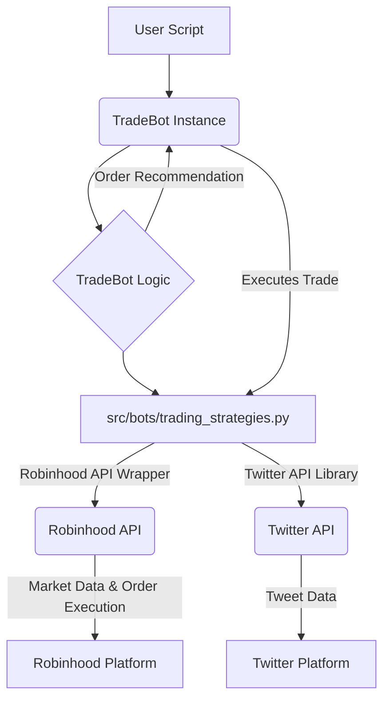

<!--
  Generated by AI-Powered README Generator
  Repository: https://github.com/ElysiumOSS/robinhood-bot
  Generated: 2025-10-11T04:20:26.509Z
  Format: md
  Style: comprehensive
-->

<a id="top"></a>

# 🚀 Robinhood Trading Bot
[](https://github.com/ElysiumOSS/robinhood-bot/actions)
[](LICENSE)
[](https://www.python.org/downloads/)
[](https://github.com/ElysiumOSS/robinhood-bot/commits/main)
[](https://github.com/ElysiumOSS/robinhood-bot/graphs/contributors)

Automate your Robinhood trades with custom and pre-built algorithmic strategies, removing emotion from your investment decisions.

## Table of Contents
*   [🚀 Overview](#overview)
*   [✨ Feature Highlights](#feature-highlights)
*   [🏗️ Architecture & Technology Stack](#architecture--technology-stack)
    *   [High-Level Architecture](#high-level-architecture)
    *   [Core Components](#core-components)
    *   [Technology Stack](#technology-stack)
*   [🏁 Getting Started](#getting-started)
    *   [Prerequisites](#prerequisites)
    *   [Installation](#installation)
    *   [Configuration](#configuration)
*   [💡 Usage & Workflows](#usage--workflows)
    *   [Using Existing Strategies](#using-existing-strategies)
    *   [Creating a Custom Strategy](#creating-a-custom-strategy)
    *   [Sample Algorithm Explanations](#sample-algorithm-explanations)
*   [⚠️ Limitations, Known Issues & Future Roadmap](#limitations-known-issues--future-roadmap)
    *   [Current Limitations](#current-limitations)
    *   [Known Issues](#known-issues)
    *   [Future Roadmap](#future-roadmap)
*   [🤝 Contributing & Development Guidelines](#contributing--development-guidelines)
    *   [How to Contribute](#how-to-contribute)
    *   [Branch & Pull Request Guidelines](#branch--pull-request-guidelines)
    *   [Code Style & Quality](#code-style--quality)
    *   [Testing](#testing)
*   [©️ License, Credits & Contact](#license-credits--contact)
    *   [License](#license)
    *   [Dependencies & Acknowledgments](#dependencies--acknowledgments)
    *   [Contact](#contact)
*   [📚 Appendix](#appendix)
    *   [FAQ](#faq)
    *   [Troubleshooting](#troubleshooting)
    *   [Changelog](#changelog)

---

## 🚀 Overview
The **Robinhood Trading Bot** is a robust Python application designed to execute automated market orders on the Robinhood platform based on predefined or custom trading algorithms. Its primary goal is to empower users to implement systematic trading strategies, thereby eliminating emotional bias and ensuring consistent execution.

This bot provides a framework for developing and deploying various algorithmic trading strategies, from simple moving average crossovers to more advanced sentiment analysis. It aims to simplify the process of connecting to Robinhood, fetching real-time data, and placing trades programmatically.

### Why it Matters / Problem it Solves
*   **Removes Emotional Bias**: Trading decisions are made strictly by logic, not fear or greed.
*   **Enables Systematic Trading**: Facilitates the execution of rule-based strategies without constant manual intervention.
*   **Simplifies API Interaction**: Abstracts away the complexities of interacting with the Robinhood API.
*   **Extensible Design**: Allows for easy integration of new trading algorithms and strategies.

### Target Audience
*   **Developers & Programmers**: Who want to leverage Python for algorithmic trading.
*   **Algorithmic Traders**: Seeking a customizable platform to test and deploy their strategies.
*   **Quantitative Analysts**: Interested in automating data-driven investment approaches.
*   **Curious Investors**: Who wish to explore the world of automated stock trading with a hands-on approach.

<p align="right"><a href="#top">Back to top</a></p>

---

## ✨ Feature Highlights

This Robinhood Trading Bot comes packed with features to get you started and provide a flexible framework for your trading needs.

*   ✅ **Seamless Robinhood Integration**: Connects securely to your Robinhood account to fetch data and execute trades.
*   🚀 **Multiple Built-in Trading Strategies**:
    *   **Simple Moving Average (SMA)**: Analyzes 50-day and 200-day moving averages for buy/sell signals.
    *   **Volume-Weighted Average Price (VWAP)**: Compares current price against VWAP for short-term entry/exit.
    *   **Twitter Sentiment Analysis**: Leverages real-time tweet sentiment to inform trading decisions.
*   🛠️ **Configurable Bot Framework**: Easily create your own unique trading algorithms by adding new strategy functions.
*   🔐 **Secure Configuration**: Utilizes environment variables (`.env`) for sensitive API keys and credentials, keeping them out of source control.
*   ⚙️ **Automated Setup**: A simple `initialize.sh` script handles virtual environment creation, dependency installation, and `.env` file generation.
*   📏 **Code Quality & Consistency**: Integrated `black`, `isort`, and `pre-commit` hooks ensure a clean and maintainable codebase.
*   📖 **Comprehensive Documentation**: Clear examples and explanations for both using existing strategies and developing new ones.

<p align="right"><a href="#top">Back to top</a></p>

---

## 🏗️ Architecture & Technology Stack

The Robinhood Trading Bot is designed with modularity in mind, allowing for easy expansion and maintenance.

### High-Level Architecture
The system follows a client-server interaction pattern where your bot acts as a client interacting with the Robinhood API (and optionally Twitter API) through a Python wrapper.



### Core Components

*   `src/bots/base_trade_bot.py`:
    *   🔍 **TradeBot**: The core trading bot class. It handles configuration, authentication, strategy execution, and order placement.
*   `src/bots/trading_strategies.py`:
    *   🚀 **Strategy Functions**: A collection of functions, each implementing a distinct trading strategy (e.g., `calculate_sma_signal`, `calculate_sentiment_signal`).
*   `src/utilities.py`:
    *   💡 **Utility Functions**: Contains helper classes for managing credentials.
*   `src/bots/config.py`:
    *   ⚙️ **Configuration Management**: Defines dataclasses for configuring all aspects of the bot, from strategies to risk management.
*   `initialize.sh`:
    *   🛠️ **Setup Script**: A shell script to automate the initial setup process: virtual environment creation, dependency installation, pre-commit hook setup, and `.env` file generation.
*   `.env.example`:
    *   🔐 **Environment Variables Template**: A template for the required environment variables.

### Technology Stack

*   **Python**: The core language for the application. (Recommended: Python 3.8+)
*   **robin_stocks**: A comprehensive Python wrapper for the Robinhood API, used for authentication, fetching market data, and placing orders.
*   **tweepy**: A user-friendly Python library for accessing the Twitter API, primarily used in the sentiment analysis strategy.
*   **pandas**: Utilized for data manipulation and analysis, especially for handling historical stock data and moving average calculations.
*   **numpy**: Provides fundamental support for numerical operations.
*   **python-dotenv**: For loading environment variables from a `.env` file.
*   **black**: An uncompromising Python code formatter.
*   **isort**: A Python utility to sort imports alphabetically and automatically separate them into sections and types.
*   **pytest**: A mature full-featured Python testing framework.

<p align="right"><a href="#top">Back to top</a></p>

---

## 🏁 Getting Started

Follow these steps to get your Robinhood Trading Bot up and running.

### Prerequisites

Before you begin, ensure you have the following:

*   **Python 3.8+**: Download and install from [python.org](https://www.python.org/downloads/).
*   **Robinhood Account**: You will need an active Robinhood brokerage account.
*   **Twitter API Keys (Optional)**: If you plan to use the sentiment analysis strategy, you'll need a [Twitter Developer Account](https://developer.twitter.com/en/portal/dashboard) to obtain API keys (`Consumer Key` and `Consumer Secret`).
*   **Multi-Factor Authentication (MFA) Setup for Robinhood**:
    *   Log into your Robinhood account.
    *   Navigate to `Menu` > `Security and privacy` > `Two-Factor Authentication`.
    *   Choose "Authenticator App" (e.g., Duo Mobile, Google Authenticator).
    *   Copy the secret key provided by Robinhood. This key is your `ROBINHOOD_MFA_CODE`. You will use this key in your authenticator app to generate TOTP codes.

### Installation

1.  **Clone the repository**:
    ```bash
    git clone https://github.com/ElysiumOSS/robinhood-bot.git
    cd robinhood-bot
    ```

2.  **Run the Initialization Script**:
    The `initialize.sh` script will set up your Python virtual environment, install all necessary dependencies, and create a `.env` file for your credentials.

    ```bash
    sh initialize.sh
    ```

    <details>
    <summary>💡 What <code>initialize.sh</code> does:</summary>
    The script performs the following actions:
    1.  Checks if a virtual environment named `env` exists. If not, it creates one.
    2.  Activates the virtual environment.
    3.  Upgrades `pip` to the latest version.
    4.  Installs all Python dependencies listed in `requirements.txt`.
    5.  Installs `pre-commit` hooks for automatic code formatting and linting.
    6.  Creates a `.env` file from the `.env.example` template if it doesn't exist.
    </details>

### Configuration

After running `initialize.sh`, you **must** update the `.env` file with your actual credentials.

1.  **Open the `.env` file**:
    ```bash
    nano .env
    # or use your preferred text editor
    ```

2.  **Populate your credentials**:
    Replace the placeholder values with your actual Robinhood and (optional) Twitter API credentials.

    ```dotenv
    # .env.example
    # This file is a template for the required environment variables.
    # Copy this file to .env and fill in your actual credentials.
    # Do NOT commit the .env file to version control.

    # Twitter API Credentials (Optional - only for sentiment analysis bot)
    TWITTER_CONSUMER_KEY="YOUR_TWITTER_CONSUMER_KEY"
    TWITTER_CONSUMER_SECRET="YOUR_TWITTER_CONSUMER_SECRET"

    # Robinhood Credentials
    ROBINHOOD_USER="YOUR_ROBINHOOD_EMAIL"
    ROBINHOOD_PASS="YOUR_ROBINHOOD_PASSWORD"
    ROBINHOOD_MFA_CODE="YOUR_ROBINHOOD_MFA_SECRET_KEY"
    ```

3.  **Activate your virtual environment**:
    Always ensure your virtual environment is active when running the bot or installing packages.
    ```bash
    source env/bin/activate
    ```

<p align="right"><a href="#top">Back to top</a></p>

---

## 💡 Usage & Workflows

Once configured, you can start using the existing strategies or create your own.

### Using Existing Strategies

To use the pre-built trading algorithms, create a new Python script in the project's root directory.

1.  **Import and Configure the `TradeBot`**:
    ```python
    # my_trade.py
    from src.bots.base_trade_bot import TradeBot
    from src.bots.config import TradingConfig, StrategyType

    # 1. Configure the strategies you want to use
    my_config = TradingConfig(
        enabled_strategies=[
            StrategyType.SMA_CROSSOVER,
            StrategyType.SENTIMENT,
        ],
        strategy_weights={
            StrategyType.SMA_CROSSOVER: 0.6,
            StrategyType.SENTIMENT: 0.4,
        }
    )

    # 2. Initialize the TradeBot with your configuration
    trade_bot = TradeBot(config=my_config)

    # 3. Execute a trade decision for a specific ticker
    trade_bot.execute_trade_decision(ticker="AAPL")
    ```

2.  **Run your script**:
    Make sure your virtual environment is active.
    ```bash
    python my_trade.py
    ```

    The `execute_trade_decision()` function will connect to Robinhood, fetch necessary data, apply the configured strategies, and execute a trade if the combined signal meets the configured thresholds.

### Creating a Custom Strategy

The framework is designed for easy extension. You can create your own custom trading logic by adding a new strategy function.

1.  **Create a new function in `trading_strategies.py`**:
    In `src/bots/trading_strategies.py`, create a new Python function that takes a ticker and a configuration object as input and returns a float between -1.0 (strong sell) and 1.0 (strong buy).

    ```python
    # src/bots/trading_strategies.py

    def calculate_my_custom_signal(df: pd.DataFrame, config: MyCustomConfig) -> float:
        """
        Implement your custom trading algorithm here.
        """
        # Your logic here
        return 0.0
    ```

2.  **Add your strategy to `StrategyType`**:
    In `src/bots/config.py`, add your new strategy to the `StrategyType` enum.

    ```python
    # src/bots/config.py

    class StrategyType(Enum):
        # ... existing strategies
        MY_CUSTOM_STRATEGY = "my_custom_strategy"
    ```

3.  **Integrate your strategy into `TradeBot`**:
    In `src/bots/base_trade_bot.py`, update the `calculate_strategy_signals` method to include your new strategy.

    ```python
    # src/bots/base_trade_bot.py

    # ... inside calculate_strategy_signals
            elif strategy == StrategyType.MY_CUSTOM_STRATEGY:
                signals[strategy] = calculate_my_custom_signal(
                    df, self.config.my_custom_config
                )
    ```

### Sample Algorithm Explanations

Here's a brief overview of the algorithms implemented in the existing strategies:

<details>
<summary><h4>📈 Moving Average Comparison (<code>calculate_sma_signal</code>)</h4></summary>
This algorithm calculates two Simple Moving Averages (SMAs): a 50-day SMA and a 200-day SMA. These are derived from historical stock prices.
*   **Buy Recommendation**: Made when the 50-day moving average is strictly greater than the 200-day moving average (a "golden cross" signal, often considered bullish).
*   **Sell Recommendation**: Made when the 50-day moving average is strictly less than the 200-day moving average (a "death cross" signal, often considered bearish).
*   **No Recommendation**: If the two moving averages are equal.
</details>

<details>
<summary><h4>📊 Volume-Weighted Average Price Comparison (<code>calculate_vwap_signal</code>)</h4></summary>
The Volume-Weighted Average Price (VWAP) is a trading benchmark that represents the average price a security has traded at throughout the day, based on both volume and price. It's calculated by summing the dollar value of all shares traded and dividing by the total shares traded over a specific period.
*   **Buy Recommendation**: Made when the current price of a security is below its VWAP (suggesting the stock is undervalued or trading at a discount for the day).
*   **Sell Recommendation**: Made when the current price of a security is above its VWAP (suggesting the stock is overvalued or trading at a premium for the day).
*   **No Recommendation**: If neither of the above conditions are met.
</details>

<details>
<summary><h4>🐦 Sentiment Analysis (<code>calculate_sentiment_signal</code>)</h4></summary>
This algorithm harnesses the power of social media by sourcing tweets mentioning a specific company via the Twitter API.
*   A sentiment analysis is performed on each collected tweet, assigning a score (negative, neutral, or positive).
*   The average sentiment score for all relevant tweets is calculated.
*   **Buy Recommendation**: Made if the average sentiment is positive.
*   **Sell Recommendation**: Made if the average sentiment is negative.
*   **No Recommendation**: If the average sentiment is neutral.
</details>

---

<p align="right"><a href="#top">Back to top</a></p>

---

## ⚠️ Limitations, Known Issues & Future Roadmap

Understanding the current state and future direction of the project is crucial.

### Current Limitations
*   **No True Backtesting**: The current framework does not include a dedicated backtesting module to evaluate strategy performance on historical data.
*   **Basic Risk Management**: Lacks advanced risk management features like stop-loss, take-profit orders, or portfolio-level risk assessment.
*   **Robinhood API Constraints**: Dependent on `robin_stocks` library and Robinhood's public API limitations, which may include rate limits, available order types, and data refresh rates.
*   **Single Ticker Focus**: The bot is designed to trade one ticker at a time per execution; no multi-asset portfolio management.
*   **No Persistent State**: Bot state (e.g., open positions, historical trades for analysis) is not persistently stored by the bot itself across runs.

### Known Issues
*   **MFA Code Generation**: Users sometimes struggle with correctly obtaining and using the `ROBINHOOD_MFA_CODE` (secret key) rather than a time-based OTP. Ensure you copy the *secret key* given by Robinhood for authenticator app setup.
*   **Rate Limiting**: Frequent calls to Robinhood or Twitter APIs might lead to temporary rate limiting. Implement delays between calls if experiencing issues.

### Future Roadmap
The following enhancements are planned or under consideration:

*   **📈 Dedicated Backtesting Module**: Allow users to test their algorithms against historical market data before live deployment.
*   **🛡️ Advanced Risk Management**: Integrate features like configurable stop-loss/take-profit, position sizing, and diversified portfolio management.
*   **🐳 Dockerization**: Provide Docker images and Docker Compose configurations for easier deployment and environment consistency.
*   **🌐 Web User Interface (UI)**: Develop a simple web interface for monitoring bot activity, configuring strategies, and viewing performance.
*   **📊 Performance Tracking & Reporting**: Implement logging and reporting tools to track bot performance over time.
*   **🔄 Recurring Trades**: Add functionality to schedule trades at specific intervals (e.g., daily, weekly) using a scheduler like `APScheduler` or `Celery`.
*   **📨 Notification System**: Integrate with messaging services (e.g., email, Discord, Telegram) for trade alerts and status updates.

<p align="right"><a href="#top">Back to top</a></p>

---

## 🤝 Contributing & Development Guidelines

We welcome contributions from the community! Whether it's bug fixes, new features, or improved documentation, your help is appreciated.

### How to Contribute

1.  **Fork the Repository**: Start by forking the `ElysiumOSS/robinhood-bot` repository to your GitHub account.
2.  **Clone Your Fork**: Clone your forked repository to your local machine.
    ```bash
    git clone https://github.com/YOUR_USERNAME/robinhood-bot.git
    cd robinhood-bot
    ```
3.  **Create a New Branch**: Always work on a new branch, giving it a descriptive name.
    ```bash
    git checkout -b feature/your-awesome-feature
    # or
    git checkout -b fix/issue-description
    ```
4.  **Make Your Changes**: Implement your feature or bug fix.
5.  **Test Your Changes**: Ensure your code works as expected and doesn't introduce regressions. Add new tests if applicable.
6.  **Commit Your Changes**: Write clear and concise commit messages.
    ```bash
    git commit -m "feat: Add new awesome trading strategy"
    ```
7.  **Push to Your Fork**: Push your new branch to your GitHub fork.
    ```bash
    git push origin feature/your-awesome-feature
    ```
8.  **Open a Pull Request (PR)**: Go to the original `ElysiumOSS/robinhood-bot` repository on GitHub and open a new Pull Request from your forked branch to the `main` branch. Provide a detailed description of your changes.

### Branch & Pull Request Guidelines
*   **Branch Naming**: Use prefixes like `feature/`, `fix/`, `docs/`, `refactor/`.
    *   `feature/add-new-indicator`
    *   `fix/mfa-auth-bug`
    *   `docs/update-installation-guide`
*   **Commit Messages**: Follow [Conventional Commits](https://www.conventionalcommits.org/en/v1.0.0/) style (e.g., `feat: Add new bot`, `fix: Correct date parsing`).
*   **Pull Request Description**: Clearly describe the problem your PR solves, how you solved it, and any potential side effects. Link to relevant issues if applicable.

### Code Style & Quality
This project enforces consistent code style and quality standards using `black`, `isort`, and `pre-commit` hooks.
*   **Automatic Formatting**: `black` automatically formats your code, and `isort` organizes imports. These are configured to run via `pre-commit` hooks.
*   **Pre-commit Hooks**: When you run `sh initialize.sh`, `pre-commit install` is executed, setting up hooks that run `black` and `isort` automatically before each commit. This ensures your code is formatted correctly every time.
*   **Manual Check**: If for any reason pre-commit hooks don't run, you can manually check and fix formatting:
    ```bash
    black .
    isort .
    ```

### Testing
*   **Test Framework**: `pytest` is used for unit and integration testing.
*   **Running Tests**: Ensure your virtual environment is active, then run tests from the project root:
    ```bash
    pytest
    ```
*   **Adding Tests**: When submitting new features or bug fixes, please include relevant tests to cover your changes.

<p align="right"><a href="#top">Back to top</a></p>

---

## ©️ License, Credits & Contact

### License
This project is licensed under the **MIT License**. See the [LICENSE](LICENSE) file for details.

```
MIT License

Copyright (c) 2022 Andrew B. Ghorbani

Permission is hereby granted, free of charge, to any person obtaining a copy
of this software and associated documentation files (the "Software"), to deal
in the Software without restriction, including without limitation the rights
to use, copy, modify, merge, publish, distribute, sublicense, and/or sell
copies of the Software, and to permit persons to whom the Software is
furnished to do so, subject to the following conditions:

The above copyright notice and this permission notice shall be included in all
copies or substantial portions of the Software.

THE SOFTWARE IS PROVIDED "AS IS", WITHOUT WARRANTY OF ANY KIND, EXPRESS OR
IMPLIED, INCLUDING BUT NOT LIMITED TO THE WARRANTIES OF MERCHANTABILITY,
FITNESS FOR A PARTICULAR PURPOSE AND NONINFRINGEMENT. IN NO EVENT SHALL THE
AUTHORS OR COPYRIGHT HOLDERS BE LIABLE FOR ANY CLAIM, DAMAGES OR OTHER
LIABILITY, WHETHER IN AN ACTION OF CONTRACT, TORT OR OTHERWISE, ARISING FROM,
OUT OF OR IN CONNECTION WITH THE SOFTWARE OR THE USE OR OTHER DEALINGS IN THE
SOFTWARE.
```

### Dependencies & Acknowledgments
This project gratefully acknowledges the following open-source projects and their contributors:
*   [robin_stocks](https://github.com/jmfernandes/robin_stocks) - A Python wrapper for the Robinhood API.
*   [tweepy](https://www.tweepy.org/) - An easy-to-use Python library for accessing the Twitter API.
*   [pandas](https://pandas.pydata.org/) - For data manipulation and analysis.
*   [numpy](https://numpy.org/) - For numerical operations.
*   [python-dotenv](https://github.com/theskumar/python-dotenv) - For managing environment variables.
*   [black](https://github.com/psf/black) - The uncompromising Python code formatter.
*   [isort](https://pycqa.github.io/isort/) - A Python utility / library to sort imports.
*   [pytest](https://docs.pytest.org/) - A testing framework.

Special thanks to **Andrew B. Ghorbani** for initiating and maintaining this project.

### Contact
For questions, suggestions, or collaborations, please feel free to:
*   Open an issue on the [GitHub Issue Tracker](https://github.com/ElysiumOSS/robinhood-bot/issues).
*   Reach out via the GitHub profile of the primary maintainer: [Andrew B. Ghorbani](https://github.com/ElysiumOSS).

<p align="right"><a href="#top">Back to top</a></p>

---

## 📚 Appendix

### FAQ

<details>
<summary><h4>❓ Is this financial advice?</h4></summary>
⚠️ **DISCLAIMER**: No, absolutely not. Any stock or ticker mentioned, and any strategy implemented by this bot, is not to be taken as financial advice. You are using this bot at your own discretion and with the full knowledge that you can lose part or all of your investment. Automated trading carries significant risks, and past performance is not indicative of future results. Always conduct your own research and consider consulting with a qualified financial advisor.
</details>

<details>
<summary><h4>❓ How do I get Twitter API keys?</h4></summary>
You need to apply for a Twitter Developer Account.
1.  Go to the [Twitter Developer Portal](https://developer.twitter.com/en/portal/dashboard).
2.  Sign up for a developer account and create a new project/app.
3.  Generate your API Key (`Consumer Key`) and API Secret (`Consumer Secret`). These will be used for `TWITTER_CONSUMER_KEY` and `TWITTER_CONSUMER_SECRET` in your `.env` file.
</details>

<details>
<summary><h4>❓ Can I run this bot continuously?</h4></summary>
Yes, you can. For continuous operation, you might consider setting up a cron job on a Linux system or a scheduled task on Windows to run your trading script at desired intervals. However, remember the limitations (e.g., rate limits) and ensure proper error handling and logging for long-running processes. For production, consider using containerization (Docker) and dedicated server environments.
</details>

<details>
<summary><h4>❓ What happens if my Robinhood MFA code expires or changes?</h4></summary>
The `ROBINHOOD_MFA_CODE` is the *secret key* you get when initially setting up an authenticator app, not the time-based OTP. This secret key generally does not expire unless you explicitly disable and re-enable MFA for your Robinhood account. If you do, you'll need to update the `ROBINHOOD_MFA_CODE` in your `.env` file with the new secret key.
</details>

### Troubleshooting

<details>
<summary><h4>🐛 `robin_stocks.exceptions.LoginFailureException: MFA code is invalid`</h4></summary>
This error usually means the `ROBINHOOD_MFA_CODE` in your `.env` file is incorrect or not the correct type of code.
*   **Ensure it's the Secret Key**: The `ROBINHOOD_MFA_CODE` should be the **long alphanumeric secret key** that Robinhood provides when you *first set up* an authenticator app (e.g., "JBSWY3DPEHPK3PXP"). It is *not* the 6-digit number generated by your authenticator app.
*   **Check for Typos**: Double-check for any typos or missing characters in the key.
*   **Re-setup MFA (if necessary)**: If unsure, you might need to disable and re-enable Authenticator App MFA in Robinhood to get a fresh secret key.
</details>

<details>
<summary><h4>🐛 `tweepy.TweepyException: Could not authenticate to Twitter.`</h4></summary>
This indicates an issue with your `TWITTER_CONSUMER_KEY` or `TWITTER_CONSUMER_SECRET`.
*   **Check `.env`**: Verify that `TWITTER_CONSUMER_KEY` and `TWITTER_CONSUMER_SECRET` in your `.env` file are correct and complete.
*   **Twitter Developer Portal**: Log in to your Twitter Developer Portal and ensure your app's API keys are still valid and that your project has the necessary permissions (e.g., "Elevated" access) to perform searches.
*   **Environment Activation**: Ensure your virtual environment is active before running the script.
</details>

<details>
<summary><h4>🐛 `ModuleNotFoundError` for a Python package</h4></summary>
This typically means a required package wasn't installed correctly or your virtual environment isn't active.
*   **Activate Virtual Environment**: Always run `source env/bin/activate` before trying to run the bot.
*   **Re-install Dependencies**: If the issue persists, try reinstalling all dependencies:
    ```bash
    source env/bin/activate
    pip install -r requirements.txt
    ```
</details>

### Changelog

**v1.1.0 - Refactoring and Unification (2025-11-01)**
*   Refactored the bot architecture to use a single, configuration-driven `TradeBot`.
*   Removed the standalone `TradeBotTwitterSentiments` and integrated it as a configurable strategy.
*   Improved security by using a `.env.example` file and updating the `initialize.sh` script.
*   Removed obsolete `sample.py` file.

**v1.0.0 - Initial Release (2022-XX-XX)**
*   Core framework for Robinhood bot with `BaseTradeBot`.
*   Implemented Simple Moving Average (SMA) strategy.
*   Implemented Volume-Weighted Average Price (VWAP) strategy.
*   Implemented Twitter Sentiment Analysis strategy.
*   Initial `initialize.sh` for easy setup.
*   Basic `.env` configuration for credentials.
*   `black`, `isort`, `pre-commit` for code quality.
*   MIT License.

**Future Releases**
*   (Planned) v1.2.0: Backtesting module and enhanced logging.
*   (Planned) v1.3.0: Dockerization for easier deployment.

<p align="right"><a href="#top">Back to top</a></p>